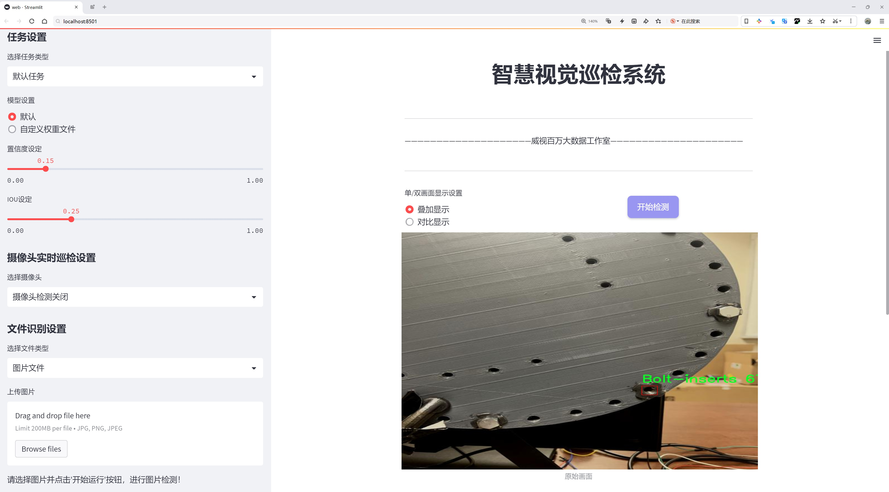
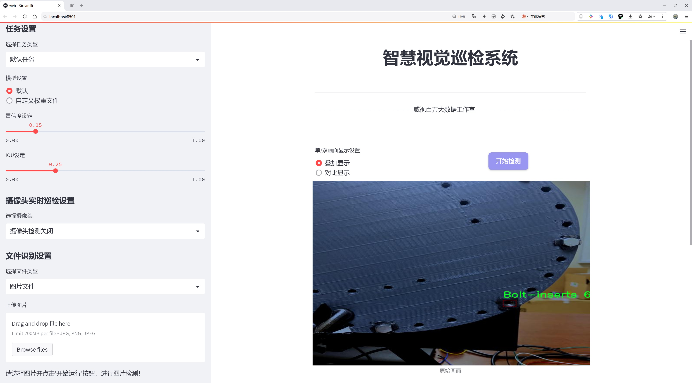
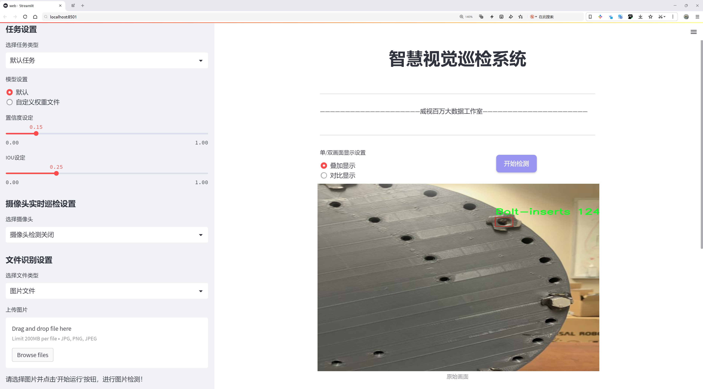
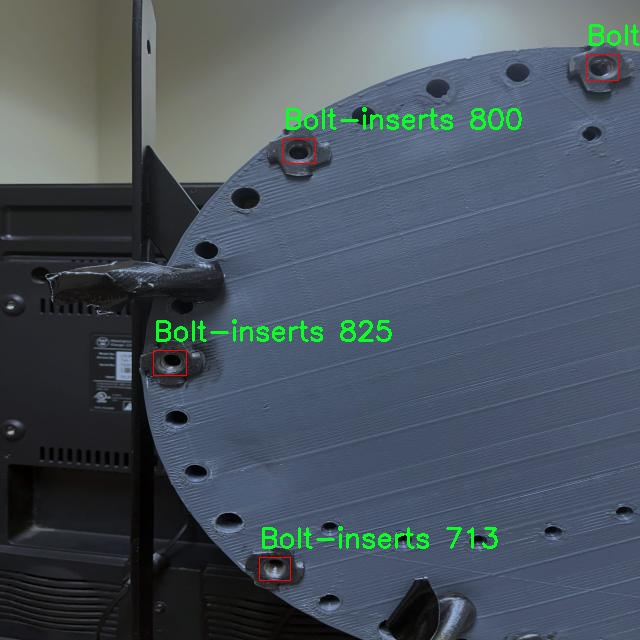
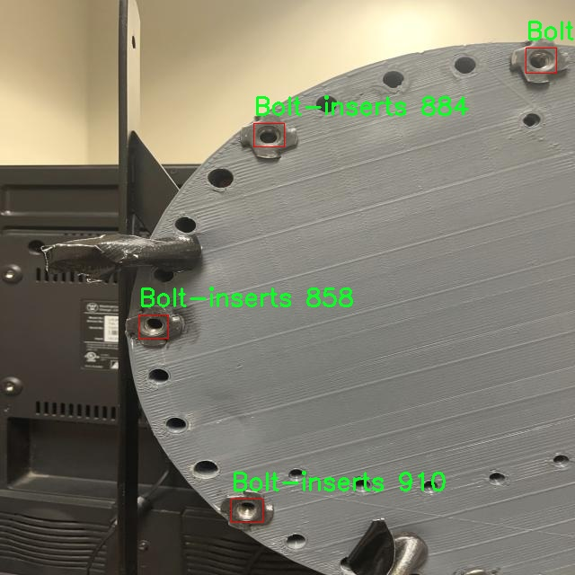
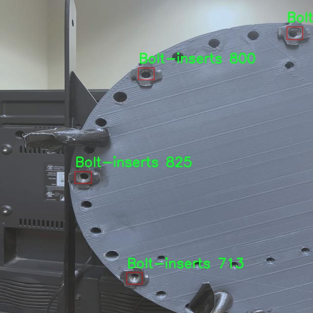
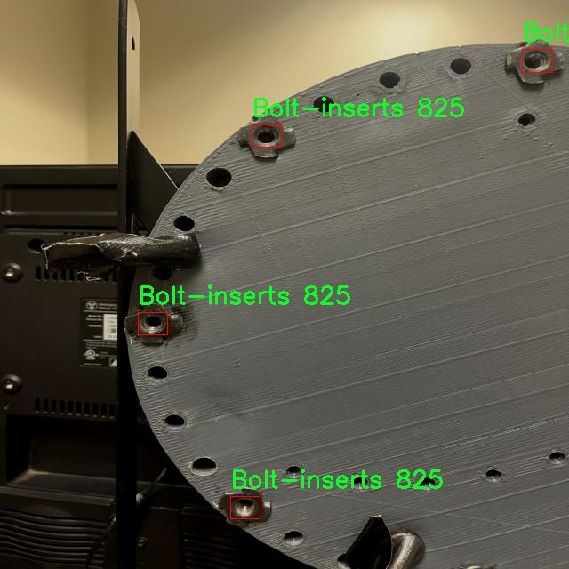
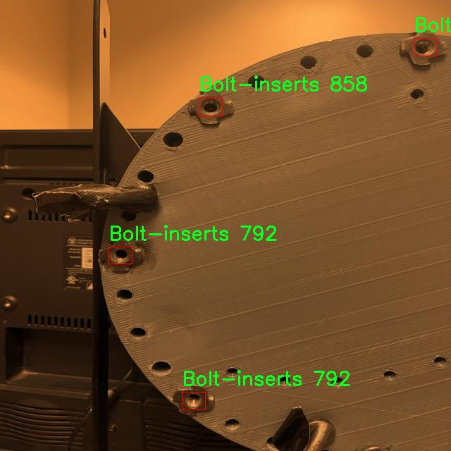

# 螺栓插入螺栓未脱落检测检测系统源码分享
 # [一条龙教学YOLOV8标注好的数据集一键训练_70+全套改进创新点发刊_Web前端展示]

### 1.研究背景与意义

项目参考[AAAI Association for the Advancement of Artificial Intelligence](https://gitee.com/qunmasj/projects)

项目来源[AACV Association for the Advancement of Computer Vision](https://kdocs.cn/l/cszuIiCKVNis)

研究背景与意义

随着工业自动化和智能制造的快速发展，机械装配过程中的质量控制显得尤为重要。在众多的装配环节中，螺栓的插入与固定是关键步骤之一。螺栓未脱落的检测不仅关乎产品的安全性和可靠性，也直接影响到生产效率和成本控制。传统的人工检测方法不仅耗时耗力，而且容易受到人为因素的影响，导致检测结果的不稳定性。因此，开发一种高效、准确的自动化检测系统成为了行业亟待解决的问题。

近年来，深度学习技术在计算机视觉领域取得了显著进展，尤其是目标检测算法的不断演化，使得机器视觉在工业检测中的应用愈加广泛。YOLO（You Only Look Once）系列算法因其高效的实时检测能力而受到广泛关注。YOLOv8作为该系列的最新版本，具备了更强的特征提取能力和更快的推理速度，适合于实时检测场景。然而，针对特定工业应用场景，YOLOv8仍然存在一定的局限性，如对小目标的检测精度不足、在复杂背景下的误检率较高等。因此，基于YOLOv8的改进方案，将其应用于螺栓插入未脱落的检测，具有重要的研究价值和实际意义。

本研究的核心在于构建一个基于改进YOLOv8的螺栓插入未脱落检测系统。为此，我们将利用一个包含4300张图像的“Bolt-Inserts”数据集，该数据集专注于螺栓插入的目标检测，具有单一类别的特点。这一数据集的构建为模型的训练和验证提供了丰富的样本基础，能够有效提升模型的泛化能力和检测精度。在数据集的标注过程中，我们将采用严格的标准，确保每一张图像中的螺栓插入状态被准确标识，以便为后续的模型训练提供高质量的数据支持。

通过对YOLOv8模型的改进，我们将针对螺栓插入的特征进行优化，提升其在小目标检测和复杂背景下的表现。具体而言，研究将集中在网络结构的调整、损失函数的改进以及数据增强技术的应用等方面，以期在保证检测速度的同时，显著提高检测精度。此外，我们还将结合实际工业场景中的光照变化、背景干扰等因素，进行模型的鲁棒性测试，确保所开发的检测系统能够在真实环境中稳定运行。

本研究不仅具有理论意义，也为实际工业应用提供了切实可行的解决方案。通过实现高效的螺栓插入未脱落检测系统，可以有效降低人工检测的成本，提高生产效率，保障产品质量，进而推动智能制造的发展。综上所述，基于改进YOLOv8的螺栓插入未脱落检测系统的研究，既是对现有目标检测技术的创新应用，也是对工业自动化检测领域的一次重要探索，具有广泛的应用前景和深远的社会经济意义。

### 2.图片演示







##### 注意：由于此博客编辑较早，上面“2.图片演示”和“3.视频演示”展示的系统图片或者视频可能为老版本，新版本在老版本的基础上升级如下：（实际效果以升级的新版本为准）

  （1）适配了YOLOV8的“目标检测”模型和“实例分割”模型，通过加载相应的权重（.pt）文件即可自适应加载模型。

  （2）支持“图片识别”、“视频识别”、“摄像头实时识别”三种识别模式。

  （3）支持“图片识别”、“视频识别”、“摄像头实时识别”三种识别结果保存导出，解决手动导出（容易卡顿出现爆内存）存在的问题，识别完自动保存结果并导出到tempDir中。

  （4）支持Web前端系统中的标题、背景图等自定义修改，后面提供修改教程。

  另外本项目提供训练的数据集和训练教程,暂不提供权重文件（best.pt）,需要您按照教程进行训练后实现图片演示和Web前端界面演示的效果。

### 3.视频演示

[3.1 视频演示](https://www.bilibili.com/video/BV1pUxFehE6v/)

### 4.数据集信息展示

##### 4.1 本项目数据集详细数据（类别数＆类别名）

nc: 1
names: ['Bolt-inserts']


##### 4.2 本项目数据集信息介绍

数据集信息展示

在本研究中，我们采用了名为“Bolt-Inserts”的数据集，以支持对改进YOLOv8模型的训练，旨在实现螺栓插入及螺栓未脱落的检测系统。该数据集专门设计用于识别和分类与螺栓插入相关的图像数据，具有独特的应用价值和广泛的工业前景。数据集的类别数量为1，主要聚焦于“Bolt-inserts”这一类别，充分体现了其专一性和针对性。

“Bolt-Inserts”数据集的构建过程经过精心设计，确保所收集的图像涵盖了各种螺栓插入的场景和条件。这些图像不仅包括了不同类型和尺寸的螺栓插入件，还考虑了多种环境因素，如光照变化、背景复杂度以及不同的拍摄角度。这种多样性使得数据集在训练过程中能够提供丰富的特征信息，帮助模型更好地学习和识别螺栓插入的状态。

在数据集的标注过程中，所有图像均经过专业人员的严格审核，确保标注的准确性和一致性。每一张图像都经过详细的标注，明确指出了螺栓插入的具体位置及其状态，形成了高质量的训练样本。这一过程不仅提高了数据集的可靠性，也为后续的模型训练奠定了坚实的基础。

为了进一步增强数据集的实用性，我们还采用了数据增强技术，对原始图像进行了多种变换，如旋转、缩放、裁剪和颜色调整等。这些增强手段有效扩展了数据集的规模，使得模型在训练过程中能够接触到更多样化的样本，从而提高其泛化能力和鲁棒性。这一策略在实际应用中尤为重要，因为螺栓插入的环境和条件往往具有高度的变异性。

在模型训练阶段，我们将“Bolt-Inserts”数据集与改进的YOLOv8模型相结合，利用其先进的特征提取和目标检测能力，旨在实现高效的螺栓插入及未脱落检测。YOLOv8模型的引入，使得我们能够在实时检测中保持高精度和高速度，满足工业自动化和智能制造的需求。

总之，“Bolt-Inserts”数据集为改进YOLOv8的螺栓插入及未脱落检测系统提供了强有力的支持。通过精心的设计、严格的标注和有效的数据增强，我们相信该数据集能够显著提升模型的性能，推动相关领域的研究与应用。未来，我们期待通过不断优化数据集和模型，进一步提升检测系统的准确性和实用性，为工业生产提供更为可靠的技术保障。











### 5.全套项目环境部署视频教程（零基础手把手教学）

[5.1 环境部署教程链接（零基础手把手教学）](https://www.ixigua.com/7404473917358506534?logTag=c807d0cbc21c0ef59de5)


[5.2 安装Python虚拟环境创建和依赖库安装视频教程链接（零基础手把手教学）](https://www.ixigua.com/7404474678003106304?logTag=1f1041108cd1f708b01a)

### 6.手把手YOLOV8训练视频教程（零基础小白有手就能学会）

[6.1 手把手YOLOV8训练视频教程（零基础小白有手就能学会）](https://www.ixigua.com/7404477157818401292?logTag=d31a2dfd1983c9668658)

### 7.70+种全套YOLOV8创新点代码加载调参视频教程（一键加载写好的改进模型的配置文件）

[7.1 70+种全套YOLOV8创新点代码加载调参视频教程（一键加载写好的改进模型的配置文件）](https://www.ixigua.com/7404478314661806627?logTag=29066f8288e3f4eea3a4)

### 8.70+种全套YOLOV8创新点原理讲解（非科班也可以轻松写刊发刊，V10版本正在科研待更新）

由于篇幅限制，每个创新点的具体原理讲解就不一一展开，具体见下列网址中的创新点对应子项目的技术原理博客网址【Blog】：


[8.1 70+种全套YOLOV8创新点原理讲解链接](https://gitee.com/qunmasj/good)

### 9.系统功能展示（检测对象为举例，实际内容以本项目数据集为准）

图9.1.系统支持检测结果表格显示

  图9.2.系统支持置信度和IOU阈值手动调节

  图9.3.系统支持自定义加载权重文件best.pt(需要你通过步骤5中训练获得)

  图9.4.系统支持摄像头实时识别

  图9.5.系统支持图片识别

  图9.6.系统支持视频识别

  图9.7.系统支持识别结果文件自动保存

  图9.8.系统支持Excel导出检测结果数据


### 10.原始YOLOV8算法原理

原始YOLOv8算法原理

YOLOv8模型是由Ultralytics团队在YOLOv5的基础上进行改进而成的最新目标检测算法，发布于2023年1月。该模型不仅吸收了过去两年半内的多项成功经验，还在网络结构和训练策略上进行了创新，以提高检测精度和速度。YOLOv8的设计目标是兼顾实时性与准确性，尤其适用于对速度和性能要求较高的应用场景，如机器人垃圾分拣系统等。

YOLOv8的网络结构主要由输入层、主干网络、颈部网络和头部网络四个部分组成。输入层负责对图像进行预处理，包括缩放和增强，以满足模型的输入要求。与以往的YOLO版本不同，YOLOv8在训练的最后10个epoch中停止使用Mosaic数据增强，这一策略旨在减少对数据真实分布的破坏，从而提升模型的学习效果和泛化能力。

在主干网络方面，YOLOv8引入了C2f模块，替代了之前的C3模块。C2f模块的设计灵感来源于YOLOv7中的ELAN结构，增加了更多的跳层连接，以此来增强梯度流动。通过这种方式，模型能够更有效地捕捉到丰富的特征信息，同时保持轻量化的特性。此外，YOLOv8仍然保留了SPPF模块，利用多个最大池化层来处理多尺度特征，从而增强网络的特征抽象能力和处理速度。

颈部网络则采用了特征金字塔网络（FPN）和路径聚合网络（PAN）的结合，这种双塔结构有效地融合了不同尺度的特征图信息，使得模型在处理不同大小目标时更加灵活和高效。通过这种特征融合，YOLOv8能够更好地理解图像中的语义信息和定位特征，从而提升检测性能。

在头部网络的设计上，YOLOv8借鉴了YOLOX的解耦头结构，采用两条并行的分支来分别处理类别和位置特征。这种设计的优势在于，分类任务更关注特征图中提取到的特征与已有类别的相似度，而定位任务则侧重于边界框与真实框之间的关系。通过这种分离，YOLOv8在收敛速度和预测精度上都有了显著提升。此外，YOLOv8采用了无锚框结构，直接预测目标的中心，并引入了任务对齐学习（TAL）机制，以优化正负样本的区分，进一步提升模型的检测效果。

YOLOv8在检测结果上表现出色，尤其是在COCO数据集上的评估中，模型在不同尺寸下的参数数量没有显著增加，但却实现了更高的检测精度和更快的推理速度。这一特性使得YOLOv8在实时目标检测任务中具备了极大的优势，尤其是在资源受限的移动平台上，YOLOv8n模型因其较小的参数量和高准确率而成为理想选择。

总的来说，YOLOv8的设计理念在于通过创新的网络结构和高效的训练策略，提升目标检测的准确性和速度。其在各个模块的改进，不仅使得模型能够更好地处理复杂的视觉任务，还为未来的研究和应用提供了广阔的空间。随着YOLOv8的推广和应用，目标检测技术的实时性和精确性将迎来新的发展机遇，为各类智能应用提供更为强大的支持。


### 11.项目核心源码讲解（再也不用担心看不懂代码逻辑）

#### 11.1 ui.py

以下是对代码的核心部分进行提炼和详细注释的版本：

```python
import sys
import subprocess

def run_script(script_path):
    """
    使用当前 Python 环境运行指定的脚本。

    Args:
        script_path (str): 要运行的脚本路径

    Returns:
        None
    """
    # 获取当前 Python 解释器的路径
    python_path = sys.executable

    # 构建运行命令，使用 streamlit 运行指定的脚本
    command = f'"{python_path}" -m streamlit run "{script_path}"'

    # 执行命令
    result = subprocess.run(command, shell=True)
    
    # 检查命令执行结果，如果返回码不为0，表示执行出错
    if result.returncode != 0:
        print("脚本运行出错。")

# 程序入口
if __name__ == "__main__":
    # 指定要运行的脚本路径
    script_path = "web.py"  # 假设脚本在当前目录下

    # 调用函数运行脚本
    run_script(script_path)
```

### 代码核心部分说明：
1. **导入模块**：
   - `sys`：用于获取当前 Python 解释器的路径。
   - `subprocess`：用于执行外部命令。

2. **`run_script` 函数**：
   - 接受一个参数 `script_path`，表示要运行的 Python 脚本的路径。
   - 使用 `sys.executable` 获取当前 Python 解释器的路径。
   - 构建一个命令字符串，使用 `streamlit` 运行指定的脚本。
   - 使用 `subprocess.run` 执行构建的命令，并检查返回码以判断是否执行成功。

3. **程序入口**：
   - 使用 `if __name__ == "__main__":` 确保代码仅在直接运行时执行。
   - 指定要运行的脚本路径（这里假设为 `web.py`）。
   - 调用 `run_script` 函数来执行指定的脚本。 

### 注意事项：
- 该代码假设 `web.py` 脚本在当前工作目录下，实际使用时可能需要根据具体情况调整路径。
- 错误处理简单，仅打印错误信息，实际应用中可以考虑更复杂的错误处理机制。

这个文件是一个 Python 脚本，主要功能是运行一个名为 `web.py` 的脚本，使用的是 Streamlit 框架。首先，文件导入了必要的模块，包括 `sys`、`os` 和 `subprocess`，这些模块分别用于处理系统相关的操作、文件路径和执行外部命令。

在文件中定义了一个名为 `run_script` 的函数，该函数接受一个参数 `script_path`，表示要运行的脚本的路径。函数内部首先获取当前 Python 解释器的路径，使用 `sys.executable` 可以获取到当前正在运行的 Python 解释器的完整路径。接着，构建一个命令字符串，使用 Streamlit 运行指定的脚本。命令的格式是 `"{python_path}" -m streamlit run "{script_path}"`，其中 `python_path` 是当前 Python 解释器的路径，`script_path` 是传入的脚本路径。

然后，使用 `subprocess.run` 方法执行这个命令。这个方法会在一个新的 shell 中运行命令，并等待命令执行完成。执行完成后，通过 `result.returncode` 检查命令的返回值，如果返回值不为 0，表示脚本运行出错，程序会打印出相应的错误信息。

在文件的最后部分，使用 `if __name__ == "__main__":` 来判断当前脚本是否是主程序。如果是主程序，则指定要运行的脚本路径为 `web.py`，并调用 `run_script` 函数来执行这个脚本。

整体来看，这个脚本的作用是提供一个简单的接口来运行 Streamlit 应用，方便用户通过命令行启动一个 web 应用。

#### 11.2 code\ultralytics\utils\__init__.py

以下是代码中最核心的部分，并附上详细的中文注释：

```python
import os
import platform
import logging
from pathlib import Path
import torch
import yaml

# 设置 PyTorch 的打印选项
torch.set_printoptions(linewidth=320, precision=4, profile="default")

# 定义一些常量
ROOT = Path(__file__).resolve().parents[1]  # 获取项目根目录
DEFAULT_CFG_PATH = ROOT / "cfg/default.yaml"  # 默认配置文件路径

# 设置日志记录
def set_logging(name="ultralytics", verbose=True):
    """设置日志记录，支持 UTF-8 编码。"""
    level = logging.INFO if verbose else logging.ERROR  # 根据是否详细输出设置日志级别
    logging.basicConfig(level=level, format='%(message)s')  # 配置日志格式
    logger = logging.getLogger(name)  # 获取日志记录器
    return logger

# 设置全局日志记录器
LOGGER = set_logging()

# YAML 文件的保存和加载函数
def yaml_save(file="data.yaml", data=None):
    """将数据保存为 YAML 格式的文件。"""
    if data is None:
        data = {}
    file = Path(file)
    if not file.parent.exists():
        file.parent.mkdir(parents=True, exist_ok=True)  # 创建父目录
    with open(file, "w", encoding="utf-8") as f:
        yaml.safe_dump(data, f, sort_keys=False, allow_unicode=True)  # 保存数据

def yaml_load(file="data.yaml"):
    """从 YAML 文件加载数据。"""
    with open(file, encoding="utf-8") as f:
        return yaml.safe_load(f) or {}  # 返回数据，确保返回字典

# 默认配置的加载
DEFAULT_CFG_DICT = yaml_load(DEFAULT_CFG_PATH)  # 加载默认配置
DEFAULT_CFG = SimpleNamespace(**DEFAULT_CFG_DICT)  # 将配置转换为简单命名空间

# 检查操作系统类型
def is_ubuntu() -> bool:
    """检查当前操作系统是否为 Ubuntu。"""
    return platform.system() == "Linux" and os.path.exists("/etc/os-release") and "ID=ubuntu" in open("/etc/os-release").read()

# 检查是否在 Docker 中运行
def is_docker() -> bool:
    """检查当前脚本是否在 Docker 容器中运行。"""
    return Path("/proc/self/cgroup").exists() and "docker" in open("/proc/self/cgroup").read()

# 其他功能函数...
```

### 代码注释说明
1. **导入模块**：导入必要的模块，如 `os`、`platform`、`logging`、`Path`、`torch` 和 `yaml`。
2. **设置 PyTorch 打印选项**：通过 `torch.set_printoptions` 设置 PyTorch 的打印格式。
3. **定义常量**：定义项目根目录和默认配置文件路径。
4. **日志记录设置**：`set_logging` 函数用于配置日志记录，支持 UTF-8 编码，返回一个日志记录器。
5. **YAML 文件操作**：`yaml_save` 和 `yaml_load` 函数用于保存和加载 YAML 格式的数据。
6. **默认配置加载**：从默认配置文件加载配置并将其转换为简单命名空间。
7. **操作系统检查**：定义 `is_ubuntu` 和 `is_docker` 函数用于检查当前操作系统类型。 

这些核心部分是代码的基础，涉及到配置管理、日志记录和环境检测等功能。

这个程序文件是Ultralytics YOLO（You Only Look Once）框架的一个初始化模块，主要用于设置和管理一些通用的工具和配置。文件中包含了多个导入的库和模块，以及一些全局常量和类的定义。

首先，文件导入了许多标准库和第三方库，包括`os`、`platform`、`logging`、`torch`等，这些库提供了文件操作、系统信息、日志记录和深度学习功能等基础支持。接着，定义了一些全局常量，例如`RANK`和`LOCAL_RANK`用于多GPU训练的环境变量，`ROOT`和`ASSETS`用于指定项目的根目录和资源目录，`DEFAULT_CFG_PATH`指定了默认配置文件的路径。

文件中还定义了一些功能函数和类。`TQDM`类是对`tqdm`库的一个封装，用于显示进度条，支持自定义参数。`SimpleClass`和`IterableSimpleNamespace`类提供了便于调试和使用的字符串表示和属性访问方法。`plt_settings`函数是一个装饰器，用于临时设置Matplotlib的绘图参数。

在设置日志记录方面，`set_logging`函数配置了日志记录的格式和级别，确保在不同环境下能够正确输出日志信息。`emojis`函数则提供了对字符串的处理，使其在不同平台上都能安全显示。

此外，文件中还包含了一些用于环境检测的函数，例如`is_ubuntu`、`is_colab`、`is_kaggle`等，用于判断当前运行环境是否为特定的操作系统或平台。还有一些函数用于检查网络连接、文件权限、Git状态等。

在最后，文件初始化了一些设置，包括全局的数据集目录、权重目录和运行目录，并调用了`set_sentry`函数来初始化错误跟踪工具Sentry。整个文件的结构清晰，功能模块化，便于后续的扩展和维护。

#### 11.3 70+种YOLOv8算法改进源码大全和调试加载训练教程（非必要）\ultralytics\engine\model.py

以下是经过简化并注释的核心代码部分：

```python
import torch
from pathlib import Path
from typing import Union
from ultralytics.nn.tasks import nn
from ultralytics.utils import LOGGER, checks

class Model(nn.Module):
    """
    YOLO模型的基础类，统一所有模型的API。
    """

    def __init__(self, model: Union[str, Path] = 'yolov8n.pt', task=None) -> None:
        """
        初始化YOLO模型。

        Args:
            model (Union[str, Path], optional): 要加载或创建的模型路径或名称，默认为'yolov8n.pt'。
            task (Any, optional): YOLO模型的任务类型，默认为None。
        """
        super().__init__()
        self.model = None  # 模型对象
        self.task = task  # 任务类型
        model = str(model).strip()  # 去除模型名称的空格

        # 检查是否为Ultralytics HUB模型
        if self.is_hub_model(model):
            from ultralytics.hub.session import HUBTrainingSession
            self.session = HUBTrainingSession(model)
            model = self.session.model_file

        # 加载或创建新的YOLO模型
        suffix = Path(model).suffix
        if suffix in ('.yaml', '.yml'):
            self._new(model, task)  # 从配置文件创建新模型
        else:
            self._load(model, task)  # 从权重文件加载模型

    def _new(self, cfg: str, task=None):
        """
        从模型定义初始化新模型并推断任务类型。

        Args:
            cfg (str): 模型配置文件
            task (str | None): 模型任务
        """
        cfg_dict = yaml_model_load(cfg)  # 加载YAML配置
        self.cfg = cfg
        self.task = task or guess_model_task(cfg_dict)  # 推断任务类型
        self.model = self._smart_load('model')(cfg_dict)  # 创建模型

    def _load(self, weights: str, task=None):
        """
        从权重文件加载模型并推断任务类型。

        Args:
            weights (str): 要加载的模型权重
            task (str | None): 模型任务
        """
        self.model, self.ckpt = attempt_load_one_weight(weights)  # 加载权重
        self.task = self.model.args['task']  # 获取任务类型

    def predict(self, source=None, stream=False, **kwargs):
        """
        使用YOLO模型进行预测。

        Args:
            source (str | int | PIL | np.ndarray): 进行预测的图像来源。
            stream (bool): 是否流式传输预测结果，默认为False。

        Returns:
            (List[ultralytics.engine.results.Results]): 预测结果。
        """
        if source is None:
            LOGGER.warning("WARNING ⚠️ 'source' is missing. Using default source.")
            source = ASSETS  # 默认来源

        # 设置预测参数
        custom = {'conf': 0.25}  # 默认置信度
        args = {**self.overrides, **custom, **kwargs}  # 合并参数

        # 初始化预测器
        if not self.predictor:
            self.predictor = self._smart_load('predictor')(overrides=args)
            self.predictor.setup_model(model=self.model)
        
        return self.predictor(source=source, stream=stream)  # 返回预测结果

    def is_hub_model(self, model):
        """检查提供的模型是否为HUB模型。"""
        return model.startswith('https://hub.ultralytics.com/models/')  # 检查URL前缀

    def _smart_load(self, key):
        """加载模型、训练器、验证器或预测器。"""
        try:
            return self.task_map[self.task][key]
        except Exception as e:
            raise NotImplementedError(f"模型不支持此任务: {self.task}") from e

    @property
    def task_map(self):
        """返回任务到模型、训练器、验证器和预测器类的映射。"""
        raise NotImplementedError('请提供任务映射！')
```

### 代码注释说明：
1. **Model类**：这是YOLO模型的基础类，负责初始化和管理模型的加载、预测等功能。
2. **__init__方法**：初始化模型时，可以指定模型的路径和任务类型。会根据输入判断是加载HUB模型还是从权重文件创建模型。
3. **_new方法**：从配置文件创建新模型并推断任务类型。
4. **_load方法**：从权重文件加载模型，并获取任务类型。
5. **predict方法**：执行预测操作，接受不同类型的输入源，并返回预测结果。
6. **is_hub_model方法**：检查给定的模型是否为HUB模型。
7. **_smart_load方法**：根据任务类型加载相应的组件（模型、训练器等）。
8. **task_map属性**：用于映射任务到相应的模型和训练器，具体实现需要子类提供。

这个程序文件是Ultralytics YOLO（You Only Look Once）模型的核心实现部分，主要定义了一个名为`Model`的类，该类用于统一处理YOLO模型的各种操作和接口。以下是对代码的详细说明。

首先，文件导入了一些必要的库，包括`torch`（PyTorch的核心库）、`inspect`、`sys`、`Path`和一些类型提示工具。接着，导入了与YOLO模型相关的配置、工具和功能模块。

`Model`类的构造函数`__init__`接收两个参数：`model`和`task`。`model`可以是模型文件的路径或名称，默认为'yolov8n.pt'，而`task`则是YOLO模型的任务类型。构造函数中初始化了一些属性，如预测器、模型对象、训练器、检查点、配置等。然后根据输入的模型路径判断是否为Ultralytics HUB模型或Triton Server模型，并相应地处理。

类中定义了多个方法，其中`__call__`方法允许通过调用`Model`实例来进行预测，实际上是调用了`predict`方法。`is_triton_model`和`is_hub_model`是静态方法，用于检查给定的模型是否为Triton Server模型或HUB模型。

`_new`和`_load`方法分别用于初始化新模型和加载已有模型的权重。`_check_is_pytorch_model`方法用于检查当前模型是否为PyTorch模型，如果不是则抛出错误。`reset_weights`方法可以重置模型的参数，`load`方法用于加载权重。

`info`方法用于记录模型的信息，`fuse`方法用于融合模型中的卷积层和批归一化层，以加快推理速度。`predict`方法是执行预测的核心方法，接受多种输入源并返回预测结果。

`track`方法用于在输入源上执行对象跟踪，`val`方法用于在给定数据集上验证模型，`benchmark`方法用于对模型在所有导出格式上的性能进行基准测试，`export`方法用于导出模型。

`train`方法是训练模型的主要功能，接受训练器和配置参数。`tune`方法用于超参数调优，支持使用Ray Tune进行调优。

此外，类中还定义了一些属性，如`names`、`device`和`transforms`，用于获取模型的类名、设备信息和变换信息。还有一些方法用于管理回调函数。

最后，`_smart_load`方法用于加载模型、训练器、验证器和预测器，`task_map`属性用于映射任务到相应的模型、训练器、验证器和预测器类。`profile`方法用于对模型进行性能分析。

总体而言，这个文件实现了YOLO模型的核心功能，提供了统一的接口来处理模型的加载、训练、预测和验证等操作，使得用户可以方便地使用YOLO模型进行目标检测任务。

#### 11.4 code\ultralytics\data\converter.py

以下是经过简化和注释的核心代码部分，主要包括 COCO 数据集的转换功能和相关的辅助函数。

```python
import json
from collections import defaultdict
from pathlib import Path
import numpy as np
from ultralytics.utils import TQDM, LOGGER
from ultralytics.utils.files import increment_path

def coco91_to_coco80_class():
    """
    将 COCO 数据集中的 91 类别 ID 转换为 80 类别 ID。
    返回一个列表，索引表示 80 类别 ID，值为对应的 91 类别 ID。
    """
    return [
        0, 1, 2, 3, 4, 5, 6, 7, 8, 9, 10, None, 11, 12, 13, 14, 15, 16, 17, 18, 19,
        20, 21, 22, 23, None, 24, 25, None, None, 26, 27, 28, 29, 30, 31, 32, 33,
        34, 35, 36, 37, 38, 39, None, 40, 41, 42, 43, 44, 45, 46, 47, 48, 49, 50,
        51, 52, 53, 54, 55, 56, 57, 58, 59, None, 60, None, None, 61, None, 62, 63,
        64, 65, 66, 67, 68, 69, 70, 71, 72, None, 73, 74, 75, 76, 77, 78, 79, None,
    ]

def convert_coco(labels_dir="../coco/annotations/", save_dir="coco_converted/", cls91to80=True):
    """
    将 COCO 数据集的标注转换为 YOLO 格式的标注。
    
    参数:
        labels_dir (str): COCO 数据集标注文件的路径。
        save_dir (str): 保存转换后结果的路径。
        cls91to80 (bool): 是否将 91 类别 ID 映射到 80 类别 ID。
    """
    # 创建保存目录
    save_dir = increment_path(save_dir)  # 如果目录已存在，则递增
    for p in save_dir / "labels", save_dir / "images":
        p.mkdir(parents=True, exist_ok=True)  # 创建目录

    # 获取 COCO 80 类别映射
    coco80 = coco91_to_coco80_class()

    # 导入 JSON 文件并处理
    for json_file in sorted(Path(labels_dir).resolve().glob("*.json")):
        fn = Path(save_dir) / "labels" / json_file.stem.replace("instances_", "")  # 生成文件夹名称
        fn.mkdir(parents=True, exist_ok=True)
        with open(json_file) as f:
            data = json.load(f)

        # 创建图像字典
        images = {f'{x["id"]:d}': x for x in data["images"]}
        # 创建图像-标注字典
        imgToAnns = defaultdict(list)
        for ann in data["annotations"]:
            imgToAnns[ann["image_id"]].append(ann)

        # 写入标注文件
        for img_id, anns in TQDM(imgToAnns.items(), desc=f"Annotations {json_file}"):
            img = images[f"{img_id:d}"]
            h, w, f = img["height"], img["width"], img["file_name"]

            bboxes = []  # 存储边界框
            for ann in anns:
                if ann["iscrowd"]:
                    continue  # 跳过人群标注
                # COCO 边界框格式为 [左上角 x, 左上角 y, 宽度, 高度]
                box = np.array(ann["bbox"], dtype=np.float64)
                box[:2] += box[2:] / 2  # 将左上角坐标转换为中心坐标
                box[[0, 2]] /= w  # 归一化 x 坐标
                box[[1, 3]] /= h  # 归一化 y 坐标
                if box[2] <= 0 or box[3] <= 0:  # 如果宽度或高度小于等于 0
                    continue

                cls = coco80[ann["category_id"] - 1] if cls91to80 else ann["category_id"] - 1  # 获取类别
                box = [cls] + box.tolist()  # 将类别和边界框合并
                if box not in bboxes:
                    bboxes.append(box)

            # 写入文件
            with open((fn / f).with_suffix(".txt"), "a") as file:
                for bbox in bboxes:
                    file.write(("%g " * len(bbox)).rstrip() % bbox + "\n")

    LOGGER.info(f"COCO 数据成功转换。\n结果保存到 {save_dir.resolve()}")
```

### 代码注释说明：
1. **coco91_to_coco80_class**: 该函数用于将 COCO 数据集中的 91 个类别 ID 转换为 80 个类别 ID，返回一个映射列表。
2. **convert_coco**: 该函数是主要的转换函数，它读取 COCO 数据集的标注文件，将其转换为 YOLO 格式并保存到指定目录。它处理图像和标注的读取、转换和写入。
3. **TQDM**: 用于显示进度条，方便用户查看处理进度。
4. **边界框处理**: 在处理每个标注时，首先将 COCO 的边界框格式转换为中心坐标，并进行归一化处理，确保适应 YOLO 的输入格式。

该代码的核心功能是将 COCO 数据集的标注格式转换为 YOLO 所需的格式，适用于训练 YOLO 模型。

这个程序文件 `converter.py` 是 Ultralytics YOLO 项目的一部分，主要用于将 COCO 数据集的注释格式转换为 YOLO 模型所需的格式。文件中包含多个函数，分别处理不同的转换任务。

首先，文件导入了一些必要的库，包括 `json`、`defaultdict`、`Path`、`cv2` 和 `numpy`，以及 Ultralytics 的一些工具函数。接下来，定义了两个函数 `coco91_to_coco80_class` 和 `coco80_to_coco91_class`，它们分别用于将 COCO 数据集的 91 类别 ID 转换为 80 类别 ID，反之亦然。这是因为 COCO 数据集中存在一些类别的合并和重新标记。

`convert_coco` 函数是该文件的核心功能，负责将 COCO 数据集的注释转换为 YOLO 格式。该函数接受多个参数，包括注释文件的目录、保存结果的目录、是否使用分割掩码和关键点注释，以及是否将 91 类别 ID 转换为 80 类别 ID。函数首先创建保存目录，然后读取指定目录下的 JSON 文件，解析图像和注释信息，并将其转换为 YOLO 格式。对于每个图像，函数会处理其对应的注释，计算边界框的中心坐标，并进行归一化处理。最终，生成的标签文件将以文本格式保存。

此外，文件中还定义了 `convert_dota_to_yolo_obb` 函数，用于将 DOTA 数据集的注释转换为 YOLO 的有向边界框格式。该函数会遍历 DOTA 数据集中的图像和原始标签，读取每个图像的宽高，并将标签转换为 YOLO 格式后保存到指定目录。

`min_index` 函数用于计算两个二维点数组之间的最短距离，并返回对应的索引。而 `merge_multi_segment` 函数则用于合并多个分割区域，通过连接各个分割的坐标来形成一个完整的分割。

整体来看，这个文件提供了对 COCO 和 DOTA 数据集注释格式的转换功能，使得用户能够方便地将数据集准备为 YOLO 模型训练所需的格式。

#### 11.5 train.py

以下是经过简化并添加详细中文注释的核心代码部分：

```python
import random
import numpy as np
import torch.nn as nn
from ultralytics.data import build_dataloader, build_yolo_dataset
from ultralytics.engine.trainer import BaseTrainer
from ultralytics.models import yolo
from ultralytics.nn.tasks import DetectionModel
from ultralytics.utils import LOGGER, RANK
from ultralytics.utils.torch_utils import de_parallel, torch_distributed_zero_first

class DetectionTrainer(BaseTrainer):
    """
    扩展自 BaseTrainer 类的检测模型训练类。
    """

    def build_dataset(self, img_path, mode="train", batch=None):
        """
        构建 YOLO 数据集。

        参数:
            img_path (str): 包含图像的文件夹路径。
            mode (str): 模式，`train` 或 `val`，用户可以为每种模式自定义不同的增强。
            batch (int, optional): 批次大小，适用于 `rect` 模式。默认为 None。
        """
        gs = max(int(de_parallel(self.model).stride.max() if self.model else 0), 32)  # 获取模型的最大步幅
        return build_yolo_dataset(self.args, img_path, batch, self.data, mode=mode, rect=mode == "val", stride=gs)

    def get_dataloader(self, dataset_path, batch_size=16, rank=0, mode="train"):
        """构造并返回数据加载器。"""
        assert mode in ["train", "val"]  # 确保模式有效
        with torch_distributed_zero_first(rank):  # 在分布式训练中，仅初始化一次数据集
            dataset = self.build_dataset(dataset_path, mode, batch_size)  # 构建数据集
        shuffle = mode == "train"  # 训练模式下打乱数据
        workers = self.args.workers if mode == "train" else self.args.workers * 2  # 根据模式设置工作线程数
        return build_dataloader(dataset, batch_size, workers, shuffle, rank)  # 返回数据加载器

    def preprocess_batch(self, batch):
        """对图像批次进行预处理，包括缩放和转换为浮点数。"""
        batch["img"] = batch["img"].to(self.device, non_blocking=True).float() / 255  # 将图像转换为浮点数并归一化
        if self.args.multi_scale:  # 如果启用多尺度
            imgs = batch["img"]
            sz = (
                random.randrange(self.args.imgsz * 0.5, self.args.imgsz * 1.5 + self.stride)
                // self.stride
                * self.stride
            )  # 随机选择新的尺寸
            sf = sz / max(imgs.shape[2:])  # 计算缩放因子
            if sf != 1:
                ns = [
                    math.ceil(x * sf / self.stride) * self.stride for x in imgs.shape[2:]
                ]  # 计算新的形状
                imgs = nn.functional.interpolate(imgs, size=ns, mode="bilinear", align_corners=False)  # 调整图像大小
            batch["img"] = imgs  # 更新批次图像
        return batch

    def get_model(self, cfg=None, weights=None, verbose=True):
        """返回 YOLO 检测模型。"""
        model = DetectionModel(cfg, nc=self.data["nc"], verbose=verbose and RANK == -1)  # 创建检测模型
        if weights:
            model.load(weights)  # 加载权重
        return model

    def plot_training_samples(self, batch, ni):
        """绘制带有注释的训练样本。"""
        plot_images(
            images=batch["img"],
            batch_idx=batch["batch_idx"],
            cls=batch["cls"].squeeze(-1),
            bboxes=batch["bboxes"],
            paths=batch["im_file"],
            fname=self.save_dir / f"train_batch{ni}.jpg",
            on_plot=self.on_plot,
        )

    def plot_metrics(self):
        """从 CSV 文件绘制指标。"""
        plot_results(file=self.csv, on_plot=self.on_plot)  # 保存结果图
```

### 代码核心部分说明：
1. **`DetectionTrainer` 类**：这是一个用于训练 YOLO 检测模型的类，继承自 `BaseTrainer`。
2. **`build_dataset` 方法**：用于构建 YOLO 数据集，支持训练和验证模式。
3. **`get_dataloader` 方法**：构造数据加载器，确保在分布式训练中只初始化一次数据集。
4. **`preprocess_batch` 方法**：对图像批次进行预处理，包括归一化和调整图像大小。
5. **`get_model` 方法**：返回一个 YOLO 检测模型，并可选择加载预训练权重。
6. **`plot_training_samples` 和 `plot_metrics` 方法**：用于可视化训练样本和训练指标，帮助分析模型性能。

这个程序文件 `train.py` 是一个用于训练 YOLO（You Only Look Once）目标检测模型的实现，基于 Ultralytics 的 YOLO 框架。程序中定义了一个名为 `DetectionTrainer` 的类，该类继承自 `BaseTrainer`，专门用于处理目标检测任务。

在这个类中，首先定义了 `build_dataset` 方法，用于构建 YOLO 数据集。该方法接收图像路径、模式（训练或验证）以及批量大小作为参数。它通过调用 `build_yolo_dataset` 函数来创建数据集，并根据模型的步幅调整图像的大小。

接下来是 `get_dataloader` 方法，它构建并返回数据加载器。该方法确保在分布式训练时只初始化一次数据集，并根据模式设置是否打乱数据。它还根据模式选择工作线程的数量。

`preprocess_batch` 方法用于对一批图像进行预处理，包括缩放和转换为浮点数。它支持多尺度训练，通过随机选择图像大小并调整图像的形状来实现。

`set_model_attributes` 方法用于设置模型的属性，包括类别数量和类别名称。它确保模型的超参数与数据集的属性相匹配。

`get_model` 方法返回一个 YOLO 检测模型，并可以加载预训练权重。`get_validator` 方法返回一个用于验证模型的 `DetectionValidator` 实例。

`label_loss_items` 方法用于返回带有标签的训练损失项字典，适用于分割和检测任务。`progress_string` 方法生成一个格式化的字符串，显示训练进度，包括当前的轮次、GPU 内存使用情况、损失值、实例数量和图像大小。

`plot_training_samples` 方法用于绘制训练样本及其注释，帮助可视化训练过程中的数据。最后，`plot_metrics` 和 `plot_training_labels` 方法分别用于绘制训练过程中的指标和创建带标签的训练图。

整体来看，这个文件实现了 YOLO 模型训练的核心功能，包括数据集构建、数据加载、模型设置、损失计算和可视化等，为用户提供了一个完整的训练框架。

#### 11.6 70+种YOLOv8算法改进源码大全和调试加载训练教程（非必要）\ultralytics\hub\session.py

以下是代码中最核心的部分，并附上详细的中文注释：

```python
import signal
import sys
from pathlib import Path
from time import sleep
import requests
from ultralytics.hub.utils import HUB_API_ROOT, HUB_WEB_ROOT, smart_request
from ultralytics.utils import LOGGER, __version__, checks, is_colab
from ultralytics.utils.errors import HUBModelError

AGENT_NAME = f'python-{__version__}-colab' if is_colab() else f'python-{__version__}-local'

class HUBTrainingSession:
    """
    HUB训练会话，用于Ultralytics HUB YOLO模型。处理模型初始化、心跳和检查点上传。
    """

    def __init__(self, url):
        """
        使用提供的模型标识符初始化HUBTrainingSession。

        参数:
            url (str): 用于初始化HUB训练会话的模型标识符。

        异常:
            ValueError: 如果提供的模型标识符无效。
            ConnectionError: 如果连接全局API密钥不被支持。
        """
        from ultralytics.hub.auth import Auth

        # 解析输入的URL
        if url.startswith(f'{HUB_WEB_ROOT}/models/'):
            url = url.split(f'{HUB_WEB_ROOT}/models/')[-1]
        if [len(x) for x in url.split('_')] == [42, 20]:
            key, model_id = url.split('_')
        elif len(url) == 20:
            key, model_id = '', url
        else:
            raise HUBModelError(f"model='{url}' not found. Check format is correct.")

        # 授权
        auth = Auth(key)
        self.agent_id = None  # 标识与服务器通信的实例
        self.model_id = model_id
        self.model_url = f'{HUB_WEB_ROOT}/models/{model_id}'
        self.api_url = f'{HUB_API_ROOT}/v1/models/{model_id}'
        self.auth_header = auth.get_auth_header()
        self.rate_limits = {'metrics': 3.0, 'ckpt': 900.0, 'heartbeat': 300.0}  # API调用的速率限制（秒）
        self.metrics_queue = {}  # 模型的指标队列
        self.model = self._get_model()  # 获取模型数据
        self.alive = True  # 心跳循环是否活跃
        self._start_heartbeat()  # 启动心跳
        self._register_signal_handlers()  # 注册信号处理器
        LOGGER.info(f'查看模型在 {self.model_url} 🚀')

    def _get_model(self):
        """从Ultralytics HUB获取并返回模型数据。"""
        api_url = f'{HUB_API_ROOT}/v1/models/{self.model_id}'

        try:
            response = smart_request('get', api_url, headers=self.auth_header, thread=False, code=0)
            data = response.json().get('data', None)

            if data.get('status', None) == 'trained':
                raise ValueError('模型已经训练并上传。')

            if not data.get('data', None):
                raise ValueError('数据集可能仍在处理。请稍等并重试。')

            self.model_id = data['id']  # 更新模型ID

            # 根据模型状态设置训练参数
            if data['status'] == 'new':
                self.train_args = {
                    'batch': data['batch_size'],
                    'epochs': data['epochs'],
                    'imgsz': data['imgsz'],
                    'patience': data['patience'],
                    'device': data['device'],
                    'cache': data['cache'],
                    'data': data['data']}
                self.model_file = data.get('cfg') or data.get('weights')
                self.model_file = checks.check_yolov5u_filename(self.model_file, verbose=False)
            elif data['status'] == 'training':
                self.train_args = {'data': data['data'], 'resume': True}
                self.model_file = data['resume']

            return data
        except requests.exceptions.ConnectionError as e:
            raise ConnectionRefusedError('ERROR: HUB服务器未在线。请稍后再试。') from e

    @threaded
    def _start_heartbeat(self):
        """开始一个线程心跳循环，向Ultralytics HUB报告代理的状态。"""
        while self.alive:
            r = smart_request('post',
                              f'{HUB_API_ROOT}/v1/agent/heartbeat/models/{self.model_id}',
                              json={'agent': AGENT_NAME, 'agentId': self.agent_id},
                              headers=self.auth_header,
                              retry=0,
                              code=5,
                              thread=False)  # 已经在一个线程中
            self.agent_id = r.json().get('data', {}).get('agentId', None)  # 更新代理ID
            sleep(self.rate_limits['heartbeat'])  # 根据速率限制休眠
```

### 代码核心部分说明：
1. **HUBTrainingSession类**：用于管理与Ultralytics HUB的训练会话，包括模型的初始化、心跳机制和模型的上传。
2. **初始化方法**：解析输入的模型URL，进行授权，设置模型的相关参数，并启动心跳机制。
3. **_get_model方法**：从Ultralytics HUB获取模型数据，处理不同的模型状态（如新模型、正在训练的模型等）。
4. **_start_heartbeat方法**：在一个线程中定期向Ultralytics HUB发送心跳请求，报告代理的状态。

这个程序文件是一个用于Ultralytics HUB YOLO模型训练会话的实现，主要负责模型的初始化、心跳监测和检查点上传等功能。首先，程序导入了一些必要的库，包括信号处理、系统操作、路径处理、时间控制和HTTP请求等。

在类`HUBTrainingSession`的构造函数中，首先解析传入的模型标识符URL，确保其格式正确。若格式不符合要求，则抛出`HUBModelError`异常。接着，程序通过`Auth`类进行身份验证，并初始化多个属性，包括与服务器通信的实例标识符、模型标识符、模型的URL、API URL、身份验证头、速率限制、定时器、模型的度量队列以及从Ultralytics HUB获取的模型数据。初始化完成后，程序启动心跳监测，并注册信号处理器，以便在接收到终止信号时能够优雅地关闭会话。

心跳监测是通过一个单独的线程实现的，定期向Ultralytics HUB报告代理的状态。程序中定义了多个私有方法来处理信号、停止心跳、上传模型度量、获取模型数据和上传模型检查点等操作。上传模型度量的方法会将当前的度量数据发送到Ultralytics HUB，而获取模型数据的方法则会根据模型的状态决定是开始新的训练还是恢复已有的训练。

在上传模型检查点时，程序会根据当前的训练周期和模型权重文件的路径进行上传，并标记当前模型是否为最佳模型或最终模型。所有的网络请求都是通过`smart_request`函数来处理，以确保请求的可靠性和有效性。

总体来说，这个程序文件提供了一个结构化的方式来管理YOLO模型的训练过程，确保与Ultralytics HUB的交互顺畅，并能够处理各种异常情况。

### 12.系统整体结构（节选）

### 整体功能和构架概括

Ultralytics YOLO项目是一个用于目标检测的深度学习框架，提供了从数据处理、模型训练到推理的完整解决方案。该项目的构架由多个模块组成，每个模块负责特定的功能，以实现高效的模型训练和推理。主要功能包括数据集的转换与处理、模型的定义与训练、用户界面的交互、以及与Ultralytics HUB的集成等。

以下是各个文件的功能整理：

| 文件路径                                                                                         | 功能描述                                                   |
|--------------------------------------------------------------------------------------------------|----------------------------------------------------------|
| `D:\tools\20240809\code\ui.py`                                                                  | 提供用户界面，运行Streamlit应用以便于交互式操作。          |
| `D:\tools\20240809\code\code\ultralytics\utils\__init__.py`                                   | 初始化工具模块，设置全局常量、日志记录、环境检测等功能。   |
| `D:\tools\20240809\code\70+种YOLOv8算法改进源码大全和调试加载训练教程（非必要）\ultralytics\engine\model.py` | 定义YOLO模型的核心功能，包括模型加载、训练、预测等。       |
| `D:\tools\20240809\code\code\ultralytics\data\converter.py`                                   | 将COCO和DOTA数据集的注释格式转换为YOLO所需格式。           |
| `D:\tools\20240809\code\train.py`                                                              | 实现YOLO模型的训练过程，包括数据加载、模型设置和损失计算。 |
| `D:\tools\20240809\code\70+种YOLOv8算法改进源码大全和调试加载训练教程（非必要）\ultralytics\hub\session.py` | 管理与Ultralytics HUB的训练会话，包括心跳监测和模型上传。   |
| `D:\tools\20240809\code\70+种YOLOv8算法改进源码大全和调试加载训练教程（非必要）\ultralytics\nn\extra_modules\ops_dcnv3\test.py` | 测试DCNv3模块的功能和性能。                               |
| `D:\tools\20240809\code\code\ultralytics\utils\patches.py`                                    | 包含对库的补丁和修改，增强功能或修复问题。                 |
| `D:\tools\20240809\code\70+种YOLOv8算法改进源码大全和调试加载训练教程（非必要）\ultralytics\models\yolo\classify\predict.py` | 实现YOLO分类模型的推理功能。                              |
| `D:\tools\20240809\code\code\ultralytics\models\sam\modules\sam.py`                           | 定义SAM（Segment Anything Model）模块的功能。              |
| `D:\tools\20240809\code\70+种YOLOv8算法改进源码大全和调试加载训练教程（非必要）\ultralytics\models\nas\model.py` | 实现神经架构搜索（NAS）模型的定义和训练。                  |
| `D:\tools\20240809\code\70+种YOLOv8算法改进源码大全和调试加载训练教程（非必要）\ultralytics\data\build.py` | 构建数据集和数据加载器，支持多种数据格式。                 |
| `D:\tools\20240809\code\code\ultralytics\cfg\__init__.py`                                     | 初始化配置模块，加载和管理模型配置文件。                   |

这些文件共同构成了一个完整的YOLO目标检测框架，支持从数据准备到模型训练和推理的各个环节，便于用户进行目标检测任务的开发和研究。

注意：由于此博客编辑较早，上面“11.项目核心源码讲解（再也不用担心看不懂代码逻辑）”中部分代码可能会优化升级，仅供参考学习，完整“训练源码”、“Web前端界面”和“70+种创新点源码”以“13.完整训练+Web前端界面+70+种创新点源码、数据集获取”的内容为准。

### 13.完整训练+Web前端界面+70+种创新点源码、数据集获取


# [下载链接：https://mbd.pub/o/bread/Zpuamp1r](https://mbd.pub/o/bread/Zpuamp1r)